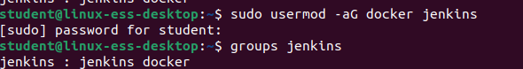
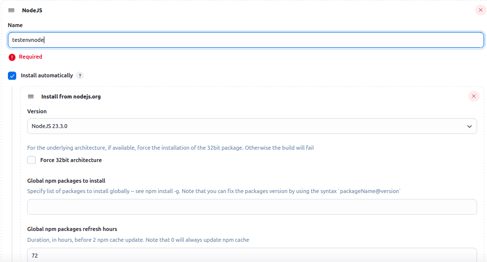
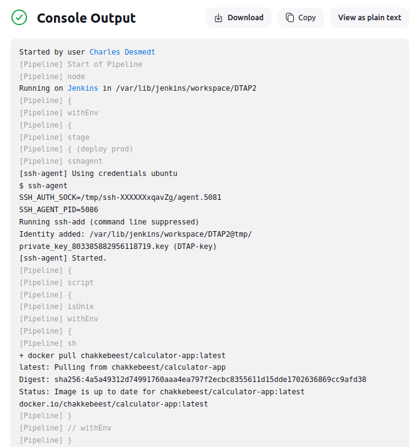
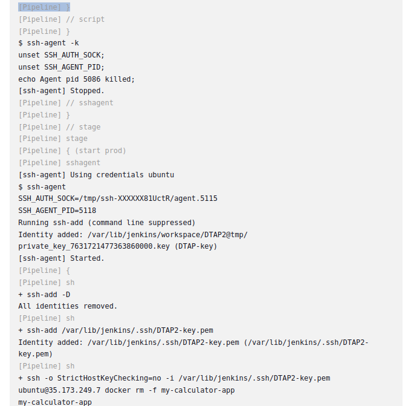
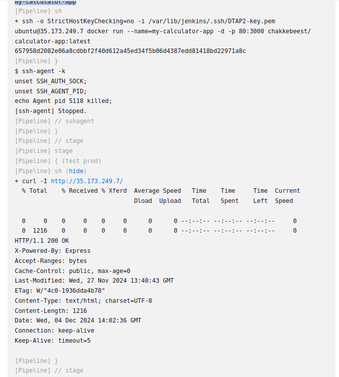
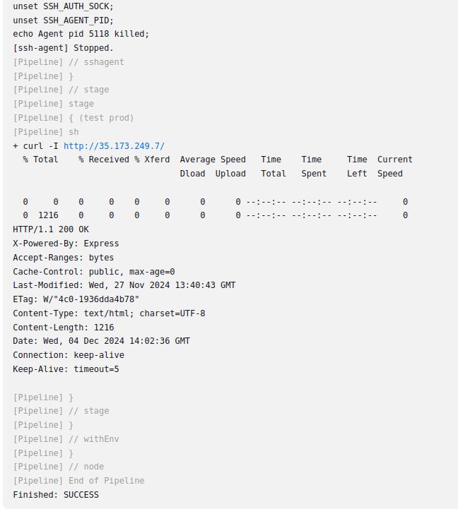
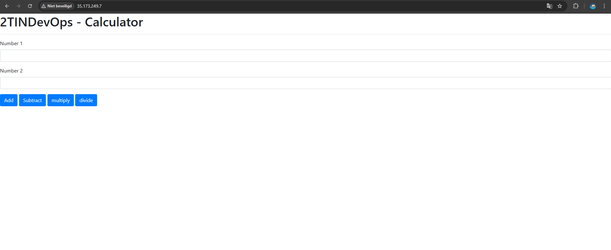
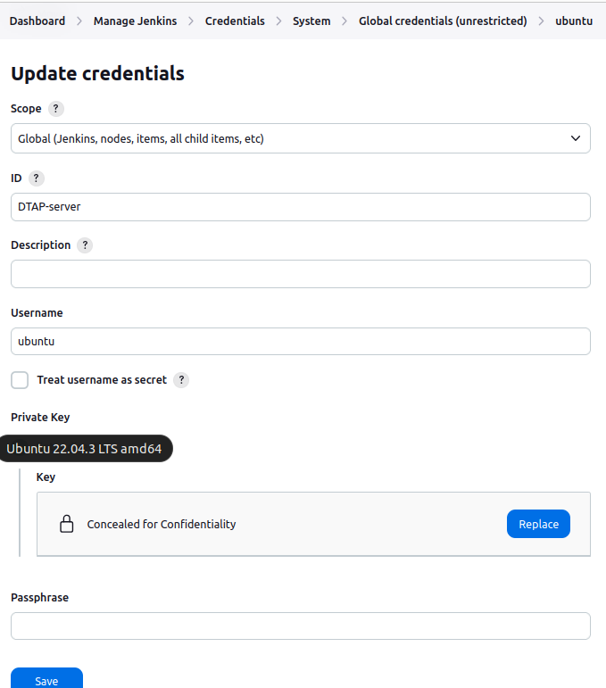

Vul onderstaande aan met de antwoorden op de vragen uit de readme.md file. Wil je de oplossingen file van opmaak voorzien? Gebruik dan [deze link](https://github.com/adam-p/markdown-here/wiki/Markdown-Cheatsheet) om informatie te krijgen over
opmaak met Markdown.

# Test.jenkinsfile
-----------------
a)Voor jenkins rechten te geven moest ik het chmod commando gebruiken die te zien is in volgende afbeelding.

De 2de afbeelding is de globale toolconfiguratie van nodeJS.

# Production.jenkinsfile
-----------------------

